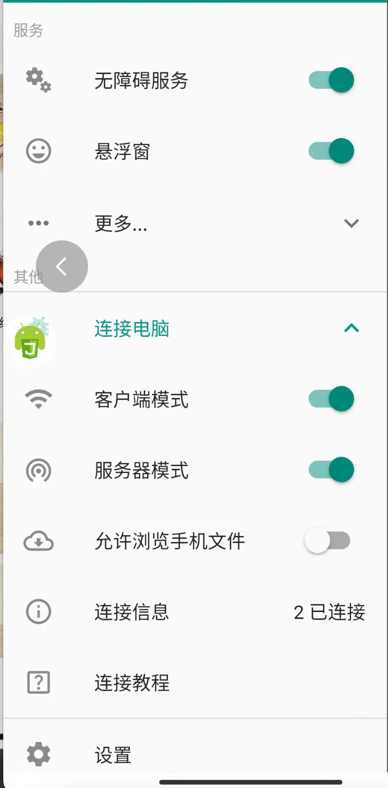

# [robFood](https://github.com/sean529/robFood)

**Disclamer:** This repository as well as materials within the repository does not contain any element of "violence" or "robbing". The title, "rob" is an exaggeration of buying food faster compare to others through utillizing the software/code in the repository.  

## [抢菜助手](https://github.com/sean529/robFood)
本项目仅用于学习，严禁用于非法或商用，如有侵权请联系本人删除！

项目地址 [https://github.com/sean529/robFood](https://github.com/sean529/robFood)
本项目是基于 autojs pro 实现的抢菜辅助脚本。

### 运行项目

1. 使用 vscode 编辑器
2. 插件 Auto.js-Pro-Ext
3. 项目依赖
   `npm 版本 8.1.0`
   `npm install`
4. 手机上安装 [autojs app](https://autojspro-apk-1252460104.cos.ap-guangzhou.myqcloud.com/autojspro8.0-latest.apk)
5. 打开 autojs app，打开无障碍服务、链接电脑：客户端模式和服务器模式都打开（手机和电脑连接相同的 wifi）
   
6. vscode 连接到新设备
7. vscode 选择刚刚连接的设备进行调试
   

